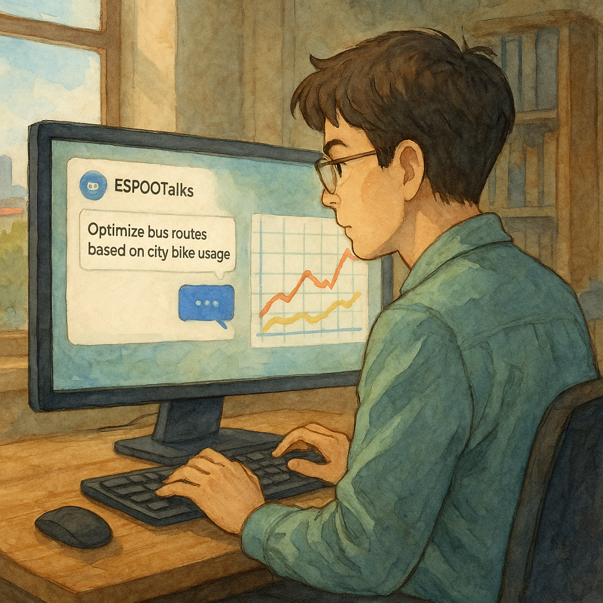
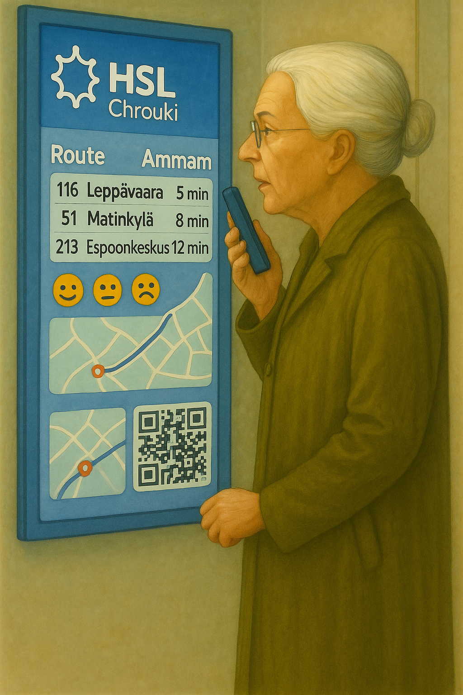
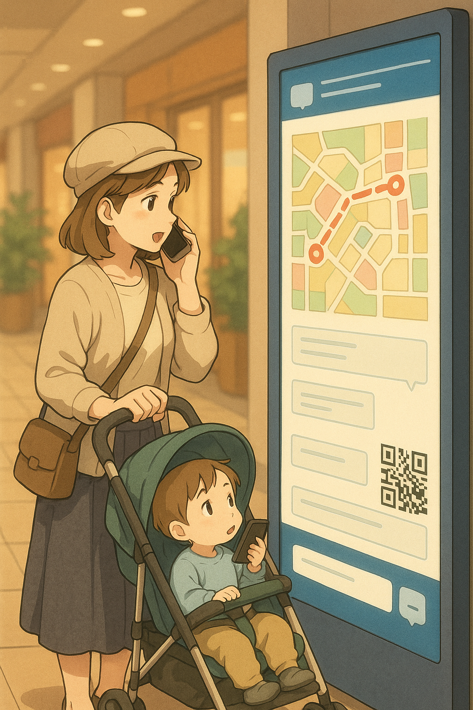

# [Espoo AI in Mobility Challenge](https://www.espoo.fi/en/welcome-espoo-ai-mobility-challenge) – NinjaLABO Proposals

---
## ✅ Proposal: [DataTalks](https://ninjalabo.ai/blogs/DataTalks.html) *(Multi-Context Conversational Urban Interface)*

### 🔖 Pilot Title

**DataTalks – Conversational Mobility Services Suite**

### 🧭 Vision

A unified voice/text interface allowing **residents and city staff to query and interact with mobility data and services** in natural language—empowering accessibility, engagement, and sustainability.

---

### 2.1. EspooTalks *(for City Planners)*

* **Goal**: Let planners access and query multimodal datasets (e.g., bike usage, transit data) using natural language.
* **KPI**: Number of planner queries, **instant feedback via internal UI**
* **Outcome**: Faster, data-driven planning decisions with minimal technical overhead

---

### 2.2. HSLTalks *(for Public Transit Users)*

* **Goal**: Offer QR-based access to DSD (Digital Signage Display) for **spoken or typed eco-friendly trip planning**, especially helpful for older users or those with vision limitations.
* **KPI**: Usage rate, eco-route adoption, accessibility metrics (e.g., languages used)
* **Outcome**: Promote modal shift away from car and bus use, contributing to CO₂ reductions

---

### 2.3. AINOATalks / OmenaTalks *(for Shopping Center Visitors)*

* **Goal**: Transform shopping center DSDs into interactive AI kiosks for navigation and user feedback collection.
* **KPI**: Interaction count, feedback response rates, diversity of user engagement
* **Outcome**: Enhance smart mobility hub usability and gather real-time civic input in commercial spaces

---

### 🛠 Common Technical Stack

* **OpenAI API**, **MCP**
* Modular backend adapted per use case (instant API mashup)
* **GenUI**

### 🗓 Schedule

* **Aug–Oct 2025**: System preparation, data integration, technical validation
* **Nov–Dec 2025**: Pilot deployment on one of DSDs in AINOA, Iso Omena and HSL.
* **Jan–Feb 2026**: Deploy for more DSDs.
* **Mar 2026**: Feedback collection, performance evaluation, and pilot wrap-up

### 💰 Cost

* Entire pilot suite operates within the €10,000 challenge budget
- Rental time for DSD ~3,000€
- Cloud Subscription ~2,000€
- R&D ~5,000€

### 📏 Cross-Pilot KPIs

* Total interactions across all DataTalks interfaces
* Number of actionable improvements derived from usage insights
* Inclusion metrics (e.g., % of non-Finnish language usage)
* Satisfaction score: target >80% positive

---

## 🧑‍🤝‍🧑 Inclusive Design Highlights

* **Voice-first interfaces** combined with **large DSDs** reduce dependency on small screens—ideal for elderly, visually impaired, and multilingual users.
* Smartphones serve as interaction relays via QR—no additional kiosk hardware required.
* **Multimodal communication** (speech input, screen output, voice replies)
* Privacy-respecting and hygienic (GDPR-compliant, contactless)

---

## 🔚 Summary

* **DataTalks** enables a scalable, inclusive smart city interface model across multiple public and planning domains.

These proposals support Espoo’s strategic goals:

* Carbon neutrality by 2030
* Equitable, accessible digital services
* AI- and data-driven innovation in urban mobility
* Active citizen participation and feedback loops

By implementing these pilots, Espoo can **lead globally in conversational, sustainable smart mobility**.
