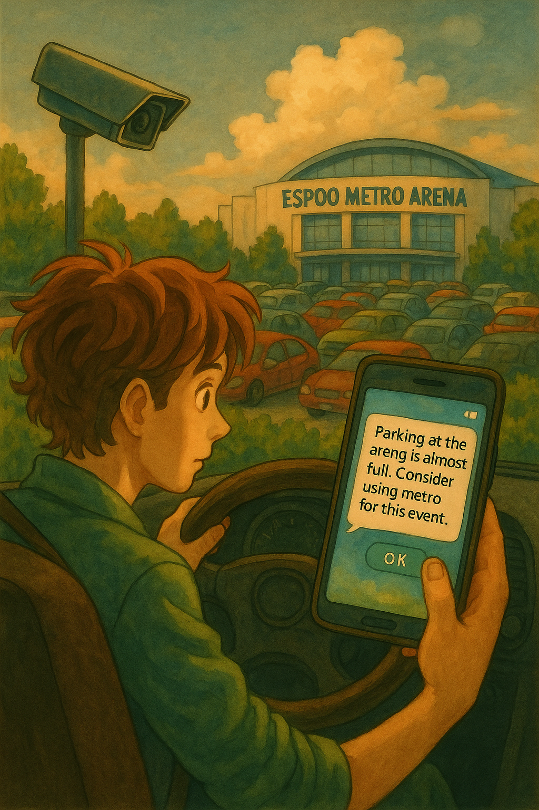

# [Espoo AI in Mobility Challenge](https://www.espoo.fi/en/welcome-espoo-ai-mobility-challenge) – NinjaLABO Proposals

---

## ✅ Proposal: EventTalks *(Instance of [CamTalks](https://ninjalabo.ai/blogs/CamTalks.html))*

### 🔖 Pilot Title

**EventTalks – AI-Powered Smart Mobility Assistant for Events**

### 🧭 Overview & Problem Statement

* Large-scale events in Espoo often lead to **traffic congestion** and **parking difficulties**, resulting in higher CO₂ emissions.
* EventTalks uses **AI-powered cameras and a conversational UI** to provide **real-time, personalized routing and parking guidance**.
* The solution contributes directly to Espoo’s **2030 carbon neutrality goal** by reducing idling, search traffic, and emissions.

### 🎯 Pilot Objectives

* Optimize event-time traffic and parking via **real-time, automated API mashups** (e.g., parking availability, bike stations, routing).
* Enhance visitor experience with **push-style guidance** delivered through a conversational interface.
* Require **no additional infrastructure** beyond overhead cameras for parking—users interact via their own smartphones.

### 🛠 Technical Components

* **LLMCAM**: Language + Vision Fusion
* **MCP**: Mobility Control Platform (aggregates camera, routing, parking data)
* **GenUI**: Generative conversational UI framework

### 📍 Pilot Location

* [Espoo Metro Areena](https://www.metroareena.fi/) (e.g., concert, festival, ice hockey events)

### 🗓 Schedule

* **Aug–Oct 2025**: System preparation, data integration, technical validation
* **Nov–Dec 2025**: Pilot deployment at Metro Arena for [FINLANDIA Trophy](https://www.finlandiatrophy.com/en/), [Kiekko Espoo Icehockey](https://kiekko-espoo.fi/ottelut-ja-liput/), and other events.
* **Jan–Feb 2026**: Deploy for other evet places if any.
* **Mar 2026**: Feedback collection, performance evaluation, and pilot wrap-up

### 💰 Cost

* Fully covered within the €10,000 grant
- Outdoor suveillance cameras x5, ~1,000€
- Installaion of cameras ~1,000€
- Cloud Subscription ~2,000€
- R&D ~4,000€
- Event Day Care ~1,000€

### 📏 Key Performance Indicators (KPIs)

* % of visitors who use EventTalks during events
* **Instant satisfaction feedback** via app after receiving route guidance
* Reduction in average parking time and circling behavior

### 💡 Unique Value

* Motivate users alternative mobile route with the incentive offered by the event organizer via push notification.
* Unlike Google Maps, EventTalks **dynamically integrates live multimodal data sources** (bikes, parking, traffic) for context-aware guidance.
* Espoo Metro Areena experiences recurring congestion—EventTalks offers a scalable solution without hardware investments beyond cameras.

---

## 🔚 Summary

* **EventTalks** tackles congestion and emissions at Espoo’s key venues using real-time data and conversational AI—**demo-ready**.

These proposals support Espoo’s strategic goals:

* Carbon neutrality by 2030
* Equitable, accessible digital services
* AI- and data-driven innovation in urban mobility
* Active citizen participation and feedback loops

By implementing these pilots, Espoo can **lead globally in conversational, sustainable smart mobility**.

