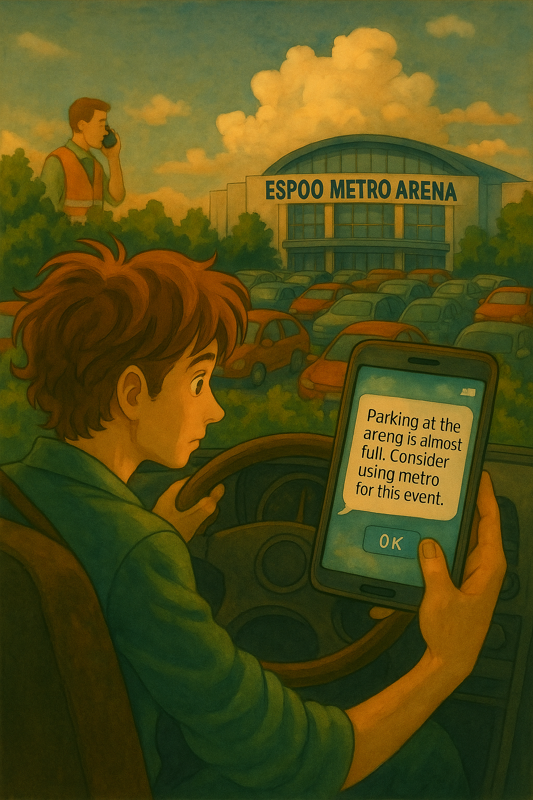
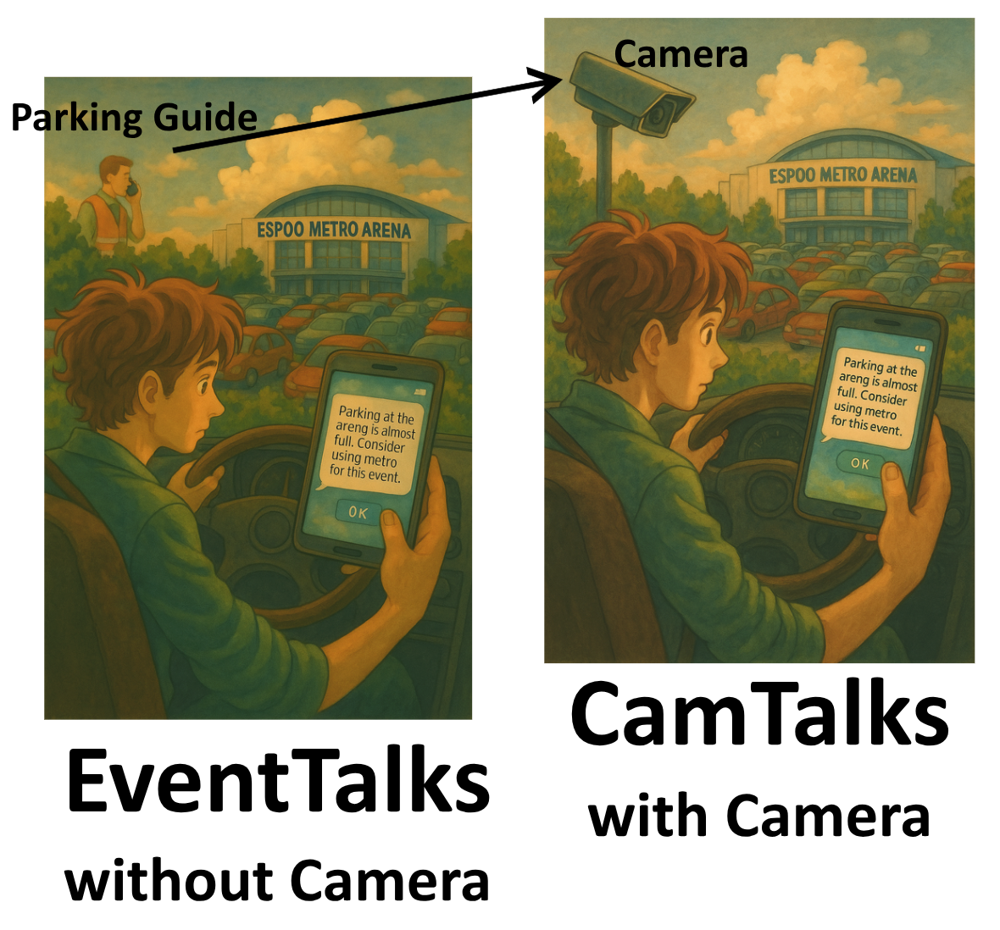

# EventTalks – Official Pilot Proposal for Demo Day 17.6.2025

{height=100%}

## 1. Pilot Title and Summary

### **Title**
EventTalks – AI-Powered Smart Mobility Assistant for Events

### **Summary**
EventTalks is a location-specific, real-time guidance system for events that integrates conversational UI and multimodal transport data to reduce congestion and enhance visitor experience—supporting Espoo’s carbon neutrality and smart mobility goals. AI camera support is optional.

## 2. Pilot Objectives

1. Reduce emissions and parking-related congestion at events through **real-time routing and parking guidance**.
2. Use **automated API mashups** (e.g. parking, traffic, weather, routing, bike stations) to provide context-aware travel recommendations.
3. Offer **intuitive, app-free user interaction** via browser-based chatbot. AI camera integration is optional.

## 3. Target User Groups

* Event visitors arriving by car, bike, or public transport
* Espoo city mobility operators (data feedback)
* Arena operators seeking smoother visitor flow

**User Benefits:**

* Clear routing before and during the event
* Shorter parking search time and less circling
* Live guidance without downloading an app

## 4. Pilot Location

* [Espoo Metro Areena](https://www.metroareena.fi/) and surrounding area
* Pilot timed with large events such as the [FINLANDIA Trophy](https://www.finlandiatrophy.com/en/) and [Kiekko Espoo](https://kiekko-espoo.fi/ottelut-ja-liput/) games

## 5. Pilot Timeline

* **Aug–Oct 2025:** System preparation, data/API integrations, parking attendant app setup, validation
* **Nov–Dec 2025:** Active pilot during 2–4 major events at Metro Areena
* **Jan–Feb 2026:** Potential extension to additional venues (if applicable)
* **Mar 2026:** Evaluation, feedback loop, and final reporting

## 6. Technical Setup

* **DFC** Dynamica Function-Calling Compiler (LLMCAM)
* **Hardware:** Camera is optional. With a camera, capture is to be fed into chatGPT to judge.
* **Software:** Hosted backend, cloud APIs, parking guide app for live status updates. Parking guides occasionally update the status of the parking occupancy.

{height=100%}

## 7. Cost Structure (Grant: €10,000)
- **Development (chat/API integration):** €4,000
- **Deployment (DFC integration):** €4,000
- **Event Day Support:** €2,000 (5 events)

## 8. Expected Outcomes and KPIs

* % of event visitors using EventTalks (measured via QR scans and active sessions)
* Reduced average parking search time (baseline vs. pilot)
* \> 80% user satisfaction in post-chat feedback

## 9. Scalability and Sustainability

* **Scalable to other venues:** Iso Omena, Tapiola Sports Park, etc.
* **Cross-city replication:** any venue with basic parking data collection
* **Long-term:** Integrate into [Espoo City Events API](https://www.espoo.fi/en/open-data) and HSL journey planning

## 10. Risks and Mitigation

* **Guide data accuracy risk:** Attendants manually update parking status via app
* **Low user uptake:** Ensure clear signage + test UI prompts during early events
* **Data/API availability:** Use offline fallback for routing data if needed

## 11. Support Needed from City or Partners

* Permit for on-site signage and data access
* Coordination with event organizers for pilot execution
* Link from the event site to the app

## 12. Proof-of-Concept or Demonstration

**What We’ll Show:**

* Real-time dashboard based on parking guide app input
* GenUI chatbot on mobile, showing directions to closest free parking
* Demo scenario: *“You arrive at the arena. Scan a QR. Ask: ‘Where can I park?’ → Updated map and route are shown based on guide updates.”*

**Impact:**
EventTalks improves traffic efficiency and CO2 performance at Espoo events using lightweight tools and human-verified parking data—reducing emissions and enhancing user satisfaction.

---

© 2025 [NinjaLABO](https://ninjalabo.ai) | Made in Finland
